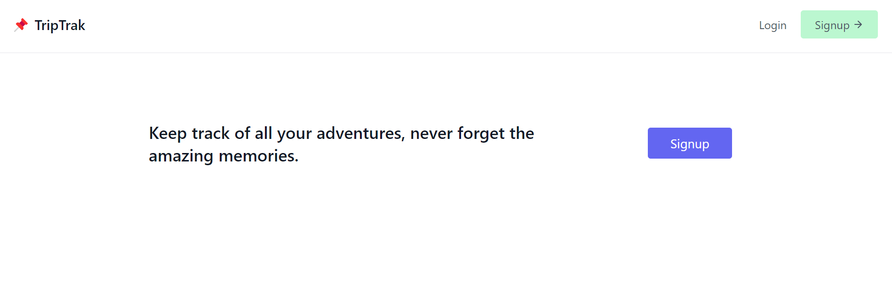
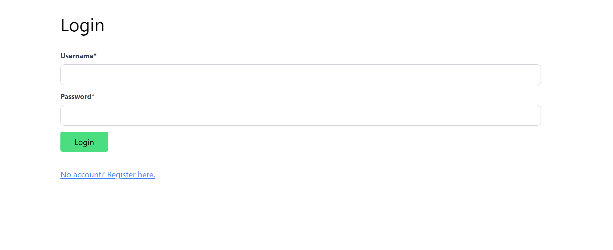
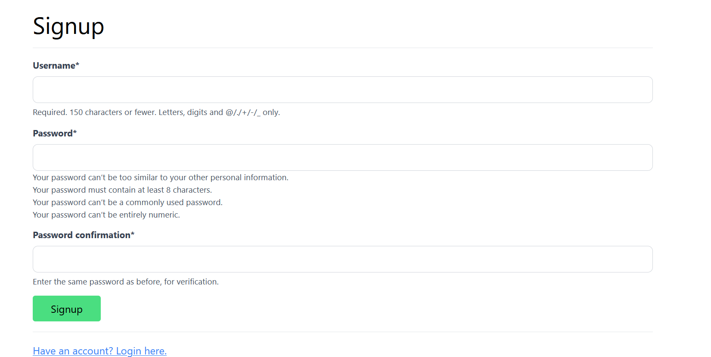
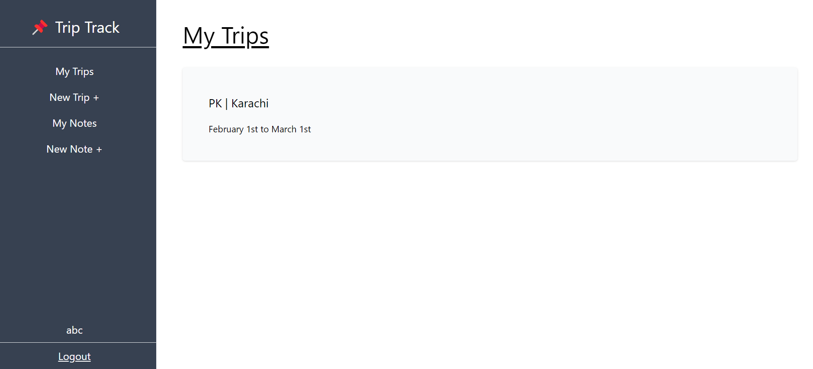
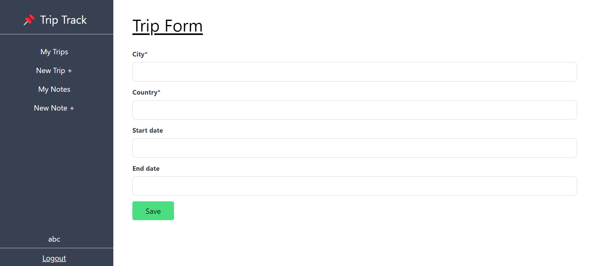
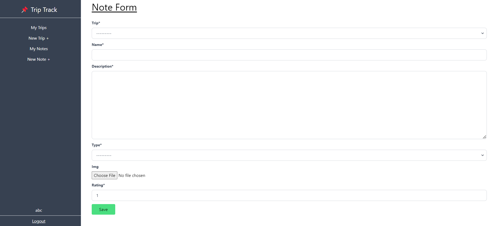
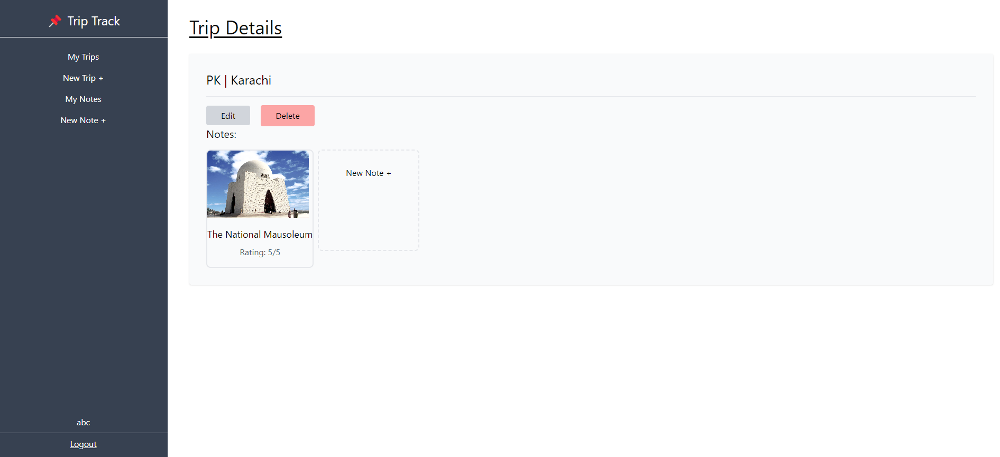

# Trip-App Documentation

## Description:
The Trip-App, built with Django and Tailwind CSS, offers a user-centric approach to streamline trip management. Create and explore trips effortlessly through intuitive interfaces, while seamlessly managing notes. Whether planning a journey or revisiting past adventures, this application ensures a hassle-free and organized travel experience. With a focus on simplicity and functionality, the Trip-App enhances the way users document and navigate their travel stories.

### Main Pages

| Main Page | Login Page | Submit Page |
| --- | --- | --- |
|  |  |  |

### Trip Pages

| Trip Main Page | Trip Form Page | My Notes Page |
| --- | --- | --- |
|  |  |  |

### Notes Pages

| Notes Form Page | Trip Details Page | Note Details Page |
| --- | --- | --- |
|  |  |  |

## Features

- **Main Page:** The landing page of the application.
- **Login Page:** Allows users to log in to their accounts.
- **Submit Page:** A page for submitting information.

- **Trip Main Page:** Displays a grid of trips.
- **Trip Form Page:** Allows users to create a new trip.
- **My Notes Page:** Shows a grid of user's notes.

- **Notes Form Page:** Enables users to add new notes.
- **Trip Details Page:** Provides detailed information about a trip.
- **Note Details Page:** Displays detailed information about a note.

## Getting Started

1. Clone the repository: `git clone https://github.com/Muhammad-Rebaal/Trip_App.git`
2. Install dependencies: `pip install -r requirements.txt`
3. Run migrations: `python manage.py migrate`
4. Start the development server: `python manage.py runserver`

## Contributing

If you'd like to contribute to the development of the Trip-App, please follow these steps:

1. Fork the repository.
2. Create a new branch: `git checkout -b feature/your-feature-name`
3. Commit your changes: `git commit -m 'Add your feature'`
4. Push to the branch: `git push origin feature/your-feature-name`
5. Submit a pull request.
